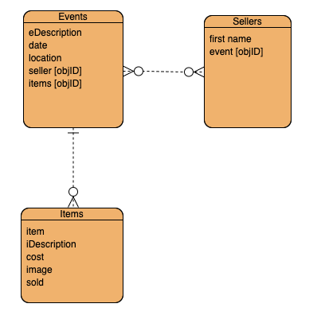

# Project 3 : e-sale

## Description
This app lets people create online store to list items for sale. Items can be marked as sold and deleted. For MVP the focus was from a seller/store owner role only whereby the store owner can manage online stores and items for sale.

## Planning
* [Planning](https://github.com/myraileen/Frontend/blob/master/planning/ProjectProposal.md)

## Repositories
* [Frontend](https://github.com/myraileen/Frontend)
* [Backend](https://github.com/mpmrjd2020/Backend)

## Deployments
* [Frontend](https://e-sale-frontend.herokuapp.com/)
* [Backend](https://e-sale-backend.herokuapp.com/)

## Dependencies
* Backend: Node, Express Mongoose, cors
* Frontend: React, React-router, React-router-dom, axios

## Wireframe

### Screen Mocks
* [home/landing page](https://wireframe.cc/Bs9KFt)
* [event page](https://wireframe.cc/RHbhrj)
* ERD  
  

### MVP
* as a user, I can create a sale event
    - event description
    - date of event
    - address of event
  - seller
    - seller name
    - sale events [ sale event ids ]
    - items for sale [ item collection ]
  - items for sale
      * seller
      * item
      * description
      * cost
      * image (url)
      * sold (boolean)
      * events [ collection of events ]
* there are three backend data models
      * seller
      * event
      * items
* react router routes  include: 
      * /(home) (list of events)
      * /event
      * /event/item

## User Stories
* as a seller, I can create (update/delete) a sale event (description, locaiton, date)
* as a seller, I can create (update/delete) an item for sale
* as a seller, I can add items to sell to my event
* as a seller, I can mark an item as sold 

## Backend DB Transactions

| METHOD | Description |
| --- | :---: | 
| GET | ('/') | Get all events and related items and the seller |
| POST | ("/new-event") | Add a new event with the seller attached to that event. The new-event post creates a new event and a new seller and relates each to the other. |
| PUT | ('/new-item' | Add a new item and attached it to the event
| DELETE | ('/event/:eventDeleteID') | Delete an event |
| DELETE | ('/delete-item/:eventId/:itemId') | Delete an item and remove it from the schema router. Here also, we are removing the item's id from the event document.  |
| PUT | ('/update-item/:itemId') | Update an item
 |
  

## Components
Based on the initial logic defined in the previous sections following is a breakdown of stateless/stateful components. 

| Component | Description | 
| --- | :---: | :---: |
| **App.js** | this component is the routing component and hosts the API calls. |
| **Events.js** | this component recieves an array of events (stores) and maps each one to the Event component. |
| **Event.js** | this component creates an event from its parent Events component. A DELETE call can be fired from this component to removed an event from the backend api. |
| **EventDetails.js** | this component displays a single event and the children Item components. There are inputs on this page to add, remove and update items. (PUT, DELETE) |
| **Item.js** | child component to EventDetails as mentioned in previous item. This component can update an item's sold property by forwarding a PUT statement to the backend API |
| **CreateEvent.js** | this component hosts the form to create new events. The CreateEvent component sends a POST call to the backend api to create a new event. |
| **CreateItem.js** | this component hosts the form to create new items. The CreateItem component sends a PUT cal to the backend api to update an event by pushing the added item into the events item array. |
| **UpdateItems.js** | this component (while not functional in the first release) was intended to update an item's properties. |
  

### Stretch
* bid/give feedback on items
* show location with map api

### Development approach
Having agreed on the app concept, we collaborated on screen mocks and captured user stories and a roughed out data and component model wireframe around an MVP. To get started, Myra created a 'frontend' respository and Patrick created a 'backend' respository. Over the weekend, we respectively worked on in our respective repositories to establish the basic installation dependencies, file structures and code. We did paired programming daily to coordinate developement effort to deliver the respective backend and frontend touchpoints. 

## Deployment
The application's backend was deployed with Heroku using MLab MongoDB and the frontend was deployed with Heroku using mars buildpack.

### Issue and Resolutions
Passing props to state was more than once a hurdle on this project. Unresolved in the app is passing the item values from the EventDetails to the UpdateItem component.
On the backend, the promise concept and managing synchronicity is challenging: for example, the seedfile routine does a basic loading, but to build it out further would require more sophistication.

